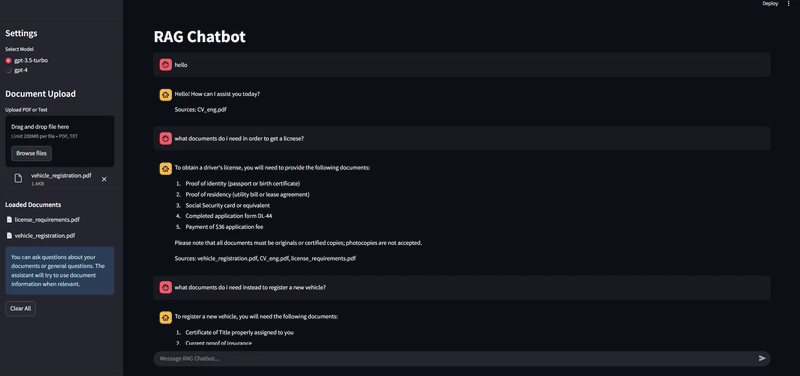

# RAG Chatbot

A Retrieval-Augmented Generation (RAG) chatbot that combines document retrieval with OpenAI's GPT models. This application allows you to upload documents (PDF/txt) and ask questions about their content.

## Video example : 




## Features

- Document processing (PDF and text files)
- ChatGPT-style interface
- Model selection (GPT-4/GPT-3.5)
- Source citation
- Chat history management
- Dark/light mode support
- General knowledge fallback

## Local Setup

1. Clone the repository:
```bash
git clone <repository-url>
cd rag-chatbot
```

2. Create and activate a virtual environment:
```bash
python -m venv CHATBOT
# On Windows
.\CHATBOT\Scripts\activate
# On macOS/Linux
source CHATBOT/bin/activate
```

3. Install dependencies:
```bash
pip install -r requirements.txt
```

4. Create a `.env` file:
```bash
cp .env.example .env
```

5. Add your OpenAI API key to the `.env` file:
```
OPENAI_API_KEY=your_openai_api_key_here
```

6. Run the application:
```bash
streamlit run app.py
```

## Deployment to Streamlit Cloud

1. Fork this repository to your GitHub account

2. Go to [Streamlit Cloud](https://streamlit.io/cloud) and sign in with your GitHub account

3. Click "New app" and select your forked repository

4. Set the following:
   - Main file path: `app.py`
   - Branch: `main`
   - Python version: 3.8 or higher

5. Add your OpenAI API key as a secret:
   - Go to "Secrets" in your app settings
   - Add a new secret with key `OPENAI_API_KEY` and your API key as the value

6. Click "Deploy!"

## Environment Variables

The following environment variables can be configured:

- `OPENAI_API_KEY`: Your OpenAI API key (required)
- `CHUNK_SIZE`: Size of text chunks for processing (default: 1000)
- `CHUNK_OVERLAP`: Overlap between chunks (default: 200)
- `EMBEDDING_MODEL`: OpenAI embedding model to use (default: text-embedding-3-small)

## Project Structure

```
rag-chatbot/
├── app.py                 # Main application file
├── requirements.txt       # Python dependencies
├── .env.example          # Example environment variables
├── .streamlit/           # Streamlit configuration
│   └── config.toml       # Streamlit theme and settings
├── README.md             # Project documentation
└── .gitignore            # Git ignore rules
```

## Contributing

1. Fork the repository
2. Create your feature branch (`git checkout -b feature/AmazingFeature`)
3. Commit your changes (`git commit -m 'Add some AmazingFeature'`)
4. Push to the branch (`git push origin feature/AmazingFeature`)
5. Open a Pull Request

## License

This project is licensed under the MIT License - see the LICENSE file for details.

